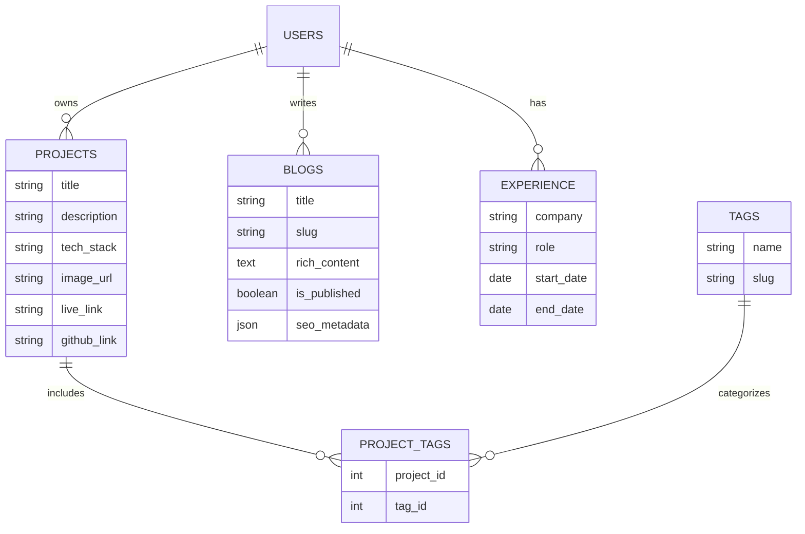

# ⚡ Stratum_CMS

### Manage and showcase your work — not just another CMS.

A developer-centric content management system enabling professionals to manage, publish, and showcase their technical work without touching source code. 

[Features](#-features) · [Tech Stack](#-tech-stack) · [Architecture](#-architecture) · [Quick Start](#-quick-start) · [API](#-api-reference)

---

## 🎯 What is Stratum_CMS?

Stratum_CMS is positioned as a purpose-built alternative to generic CMS tools like WordPress or Contentful. It deeply understands the developer's context — GitHub repositories, tech stacks, project categories, and blog writing — and intelligently surfaces that content to the public.

**Perfect for:**
- 👨‍💻 **Software Engineers** — sync your GitHub projects automatically.
- ✍️ **Tech Bloggers** — write posts in Markdown or a rich text editor.
- 🚀 **Freelancers** — showcase your tech stack, experience, and timeline dynamically.
- 🏢 **SaaS Founders** — multi-tenant architecture to host portfolios for others.

---

## ✨ Features

<table>
<tr>
<td width="50%">

### 🔄 GitHub Integration
Connect via OAuth or token to directly import repositories into your project collection. Automatically syncs repository name, description, star count, and detected tech stack.

### 🤖 Smart Automation & Tagging
Upload a PDF resume to auto-extract and pre-fill experience entries and skill tags. The system auto-suggests tags based on blog post content analysis and imported GitHub data.

### 📝 Production-Grade Editing
Rich text editor integration (e.g., TipTap or Quill) alongside optional Markdown support. Includes Draft/Publish toggles, SEO-friendly slugs, and media handling via cloud storage.

</td>
<td width="50%">

### 🏢 SaaS Multi-Tenancy
Built to scale into a multi-user platform. Features strict data isolation, role-based access controls, and subdomains (username.app.com) provisioned automatically on signup.

### 📊 Analytics Dashboard
Track page views per portfolio section, project card clicks, and blog post reads (with estimated read completions).

### 🎨 Custom Themes & Domains
Multiple pre-built portfolio themes with seamless switching without data loss. Premium users get custom domain support with automatically provisioned SSL.

</td>
</tr>
</table>

**And also:** JWT-based Token Management · Advanced Public Filtering · Email Verification · Stripe Monetization · Secure Image Uploads

---

## 🛠️ Tech Stack

<table>
<tr>
<td align="center" width="33%"><b>Frontend</b></td>
<td align="center" width="33%"><b>Backend</b></td>
<td align="center" width="33%"><b>Infrastructure</b></td>
</tr>
<tr>
<td>

- React + JavaScript
- Vite Bundler
- Strict Mode Enabled

</td>
<td>

- Node.js
- Express or Fastify
- Prisma ORM
- JWT Authentication

</td>
<td>

- PostgreSQL
- Cloud-hosted VPS / PaaS
- Cloudinary / AWS S3
- GitHub Actions CI/CD

</td>
</tr>
</table>

*Note: PostgreSQL was chosen over NoSQL to enforce domain relationships (projects, tags, blogs, experience) at the schema level, ensuring guaranteed data consistency.*

---

## 🏗️ Architecture

### Database Schema

